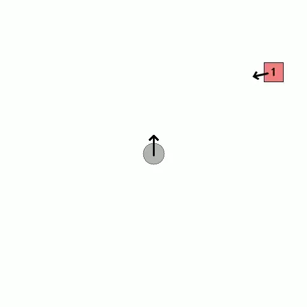
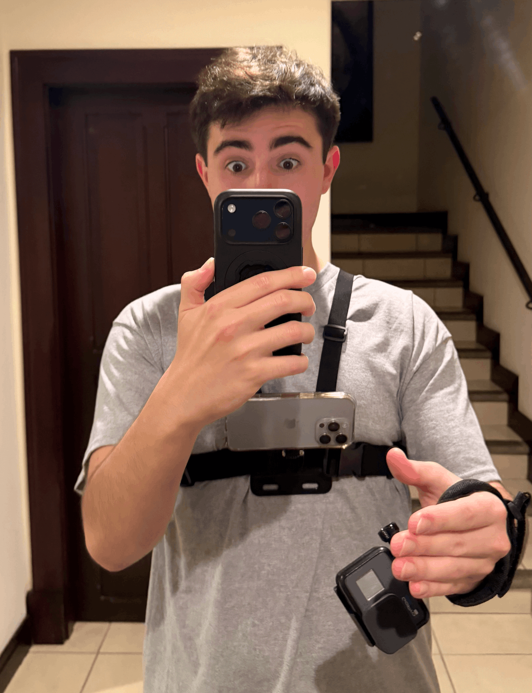
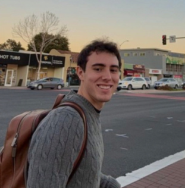
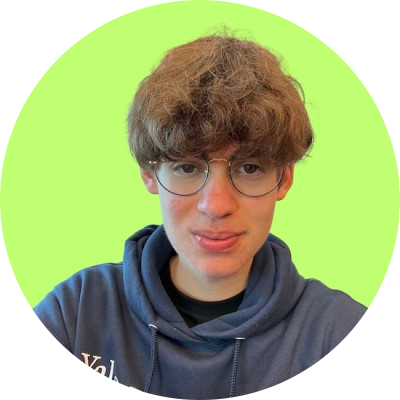

<div align="center">
  
  <br />
  <br />
</div>

<div align="center">
  <h1><code>Spatial-MemER</code></h1>
  <p>Spatial Memory for Hierarchical VLA Policies</p>
    <a href="https://spatial-memer.vercel.app/"><b>Learn more & see demos »</b></a>
    <br />
    <br />
  <p>
    
    
    
  </p>
  <p><em>Extending <a href="https://jen-pan.github.io/memer/">MemER: Scaling Up Memory for Robot Control via Experience Retrieval</a>.</em></p>
</div>

---

MemER's keyframes capture *what* the robot saw — but not *where*. Spatial-MemER adds egocentric spatial context by computing camera poses via forward kinematics (stationary robots) or [DPVO](https://arxiv.org/abs/2208.04726) (mobile robots), rendered as a bird's-eye map that the high-level VLM policy can directly perceive.


## Installation

```bash
# Clone the repository
git clone https://github.com/markmusic27/spatial-memer.git
cd spatial-memer

# Install with uv (recommended)
uv sync

# Or with pip
pip install -e .
```

### For Mobile Robots (DPVO)

DPVO requires CUDA. Skip this if you only need stationary robot support.

```bash
./scripts/setup_dpvo.sh

# Or download-only (no CUDA required)
./scripts/setup_dpvo.sh --download-only
```

## Quick Start

### Stationary Robot (Forward Kinematics)

```python
import numpy as np
import sys
sys.path.insert(0, "src")

from spatial_context import SpatialContext

# Initialize
ctx = SpatialContext()

# In your policy loop (1 Hz)
joint_angles = np.array([0.0, -0.5, 0.0, -2.0, 0.0, 1.5, 0.8])  # 7-DOF

# 1. Add frame (computes pose via forward kinematics)
frame_id = ctx.add_frame(joint_angles)

# 2. Promote to keyframe when selected by MemER
ctx.promote_to_keyframe(frame_id)

# 3. Generate spatial map
map_image, colors = ctx.generate_map()

# 4. Watermark keyframes to match map markers
keyframe_images = [(frame_id, your_keyframe_image)]
watermarked = ctx.watermark_keyframes(keyframe_images, colors)

# Feed map_image + watermarked keyframes to your VLM!
```

### Mobile Robot (DPVO + FK)

```python
from spatial_context import SpatialContext
from localization import Localization, load_camera_intrinsics

# Initialize localization
intrinsics = load_camera_intrinsics("external/DPVO/calib/iphone.txt")
localizer = Localization(intrinsics, device="cuda:0")
ctx = SpatialContext()

# High-rate loop (30 Hz camera)
for frame_idx, rgb_frame in enumerate(camera_stream):
    timestamp = frame_idx / 30.0
    
    # Get robot base pose from DPVO
    robot_pose = localizer.update(rgb_frame, timestamp)
    if robot_pose is None:
        continue  # Still initializing
    
    # Low-rate loop (1 Hz policy)
    if frame_idx % 30 == 0:
        joint_angles = robot.get_joint_angles()
        frame_id = ctx.add_frame(joint_angles, robot_pose)
        map_image, colors = ctx.generate_map()
```

## Project Structure

```
spatial-memer/
├── src/
│   ├── spatial_context.py   # Main API: pose storage, map generation, watermarking
│   ├── robot_arm.py         # Forward kinematics via MuJoCo (FR3 Panda)
│   ├── localization.py      # DPVO wrapper for visual odometry
│   └── transforms.py        # SE(3) utilities (relative pose, quaternion, etc.)
├── scripts/
│   ├── setup_dpvo.sh        # DPVO installation script
│   ├── test_pose.py         # Test forward kinematics
│   ├── test_spatial_context.py  # Test map generation
│   └── test_localization.py # Test DPVO integration
├── fr3v2/                   # Franka FR3 robot model (MuJoCo XML + meshes)
├── assets/                  # Test images/videos
└── landing-page/            # Project website
```

## API Reference

### `SpatialContext`

The main interface for spatial memory management.

```python
from spatial_context import SpatialContext, MapConfig

# Custom map configuration
config = MapConfig(
    image_size=512,          # Output map size (pixels)
    keyframe_radius=16,      # Marker size
    robot_radius=18,         # Robot marker size
    outlier_std_threshold=2, # Outlier detection threshold
)

ctx = SpatialContext(
    relocalization=False,    # Not used (reserved for future)
    map_config=config,
    avoid_overlap=True       # Prevent marker overlap
)
```

**Methods:**

| Method | Description |
|--------|-------------|
| `add_frame(robot_state, robot_pose=None)` | Add frame, compute pose via FK. Returns `frame_id`. |
| `add_frame_with_pose(pose)` | Add frame with pre-computed SE(3) pose (bypass FK). |
| `promote_to_keyframe(frame_id)` | Promote a frame to keyframe status. |
| `remove_keyframe(frame_id)` | Remove a keyframe. |
| `generate_map()` | Generate egocentric BEV map. Returns `(image, colors_dict)`. |
| `watermark_keyframes(keyframes, colors)` | Watermark keyframe images with colored markers. |
| `get_current_pose()` | Get the most recent pose. |

### `RobotArm`

Forward kinematics for the Franka Emika Panda (FR3) using MuJoCo.

```python
from robot_arm import RobotArm

arm = RobotArm()
joint_angles = np.array([0.0, -0.5, 0.0, -2.0, 0.0, 1.5, 0.8])  # 7 joints
ee_pose = arm.forward_kinematics(joint_angles)  # Returns 4x4 SE(3) matrix
```

### `Localization`

Visual odometry for mobile robots using DPVO.

```python
from localization import Localization, load_camera_intrinsics

# Load camera calibration (fx fy cx cy)
intrinsics = load_camera_intrinsics("path/to/calib.txt")

localizer = Localization(
    camera_intrinsics=intrinsics,
    camera_to_world=np.eye(4),  # Optional transform
    weights_path="external/DPVO/dpvo.pth",
    device="cuda:0"
)

# Process frame
pose = localizer.update(rgb_image, timestamp)  # Returns 4x4 SE(3) or None

# Get full trajectory
trajectory = localizer.get_trajectory()  # Nx4x4 array
```

## Testing

```bash
# Test forward kinematics
python scripts/test_pose.py

# Test spatial context + map generation
python scripts/test_spatial_context.py

# Test DPVO integration (requires CUDA + setup)
python scripts/test_localization.py
```

## How It Works

### Localization Pipeline

**Stationary robots** (arm clamped to table):
```
Joint Angles → Forward Kinematics → Camera Pose → Spatial Map
   (7-DOF)         (MuJoCo)           (SE(3))      (BEV image)
```

**Mobile robots** (moving base):
```
RGB Frames → DPVO → Base Pose → Combined with FK → Spatial Map
                    (15 Hz)
```

### Map Generation

1. **Pose storage**: All frames stored with their SE(3) camera pose
2. **Relative positioning**: Keyframes positioned relative to current robot pose
3. **Automatic scaling**: Map scales to fit all keyframes
4. **Outlier handling**: Distant keyframes (>2σ) clamped to edge
5. **Overlap resolution**: Spiral placement prevents marker collisions
6. **Visual correspondence**: Colored numbered markers match watermarked keyframes

<div align="center">
  
  <p><em>Our "robot" — a chest-mounted iPhone + wrist GoPro for data collection without hardware.</em></p>
</div>

## Integration with MemER

```python
# Existing MemER loop
for timestep in episode:
    observation = env.get_observation()
    
    # === ADD: Spatial-MemER ===
    frame_id = spatial_ctx.add_frame(robot.joint_angles)
    map_image, colors = spatial_ctx.generate_map()
    watermarked = spatial_ctx.watermark_keyframes(keyframes, colors)
    # === END ===
    
    # Policy now receives spatially-enhanced context
    action = policy(watermarked, map_image, memory)
```

## Authors

<div align="center">
  <table>
    <tr>
      <td align="center">
        <br />
        <b>Mark Music</b><br />
        Stanford '28<br />
        CS (AI track) & Math<br />
        <a href="mailto:mmusic@stanford.edu">mmusic@stanford.edu</a>
      </td>
      <td align="center">
        <br />
        <b>Filippo Fonseca</b><br />
        Yale '28<br />
        MechE (ABET) & EECS<br />
        <a href="mailto:filippo.fonseca@yale.edu">filippo.fonseca@yale.edu</a>
      </td>
    </tr>
  </table>
</div>

---

This project builds on the [MemER](https://arxiv.org/abs/2510.20328) framework by Ajay Sridhar, Jennifer Pan, Satvik Sharma, and Chelsea Finn at Stanford.

Apache 2.0 License · Made with love in Costa Rica for the robot learning research community.
